<a name="readme-top"></a>

<!-- PROJECT LOGO -->
<br />
<div align="center">
  <a href="https://github.com/PhanGiaPhat/slack-bot-translate">
    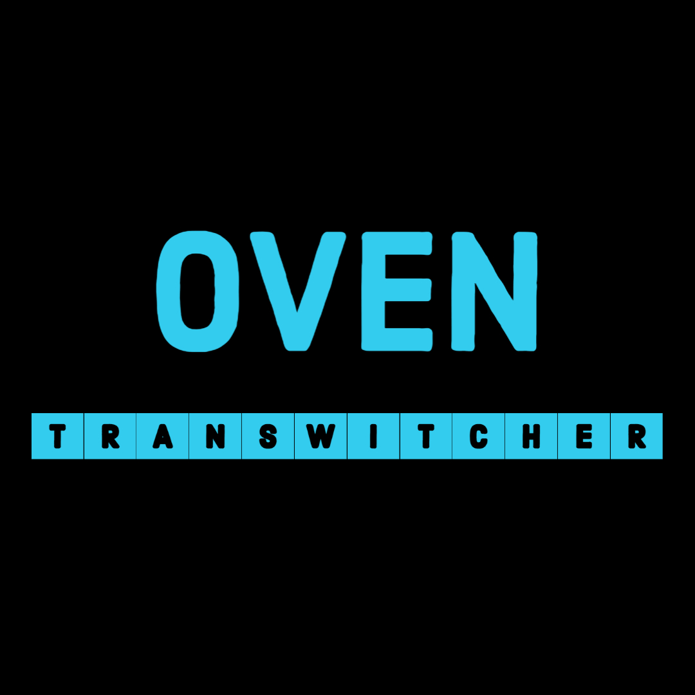
  </a>

  <h3 align="center">Slack Bot Translate</h3>

  <p align="center">
    Slack bot that translates language with Slack Bolt, Google Translate API, MongoDB.
    <br />
    <a href="https://github.com/PhanGiaPhat/slack-bot-translate"><strong>Explore the docs »</strong></a>
    <br />
    <br />
    <a href="https://github.com/PhanGiaPhat/slack-bot-translate">View Demo</a>
    ·
    <a href="https://github.com/PhanGiaPhat/slack-bot-translate/issues">Report Bug</a>
    ·
    <a href="https://github.com/PhanGiaPhat/slack-bot-translate/issues">Request Feature</a>
  </p>
</div>

<!-- TABLE OF CONTENTS -->
<details>
  <summary>Table of Contents</summary>
  <ol>
    <li>
      <a href="#about-the-project">About The Project</a>
      <ul>
        <li><a href="#built-with">Built With</a></li>
      </ul>
    </li>
    <li>
      <a href="#getting-started">Getting Started</a>
      <ul>
        <li><a href="#prerequisites">Prerequisites</a></li>
        <li><a href="#installation">Installation</a></li>
      </ul>
    </li>
    <li><a href="#usage">Usage</a></li>
    <li><a href="#roadmap">Roadmap</a></li>
    <li><a href="#contributing">Contributing</a></li>
    <li><a href="#license">License</a></li>
    <li><a href="#contact">Contact</a></li>
    <li><a href="#acknowledgments">Acknowledgments</a></li>
  </ol>
</details>


<!-- ABOUT THE PROJECT -->
## About The Project

<div align="center">
    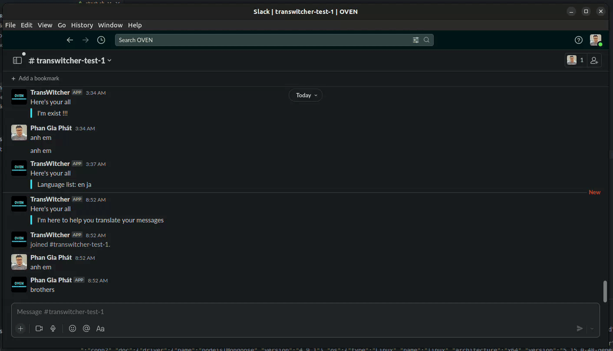
</div>

### Introduction To Slack
There are still a lot of people who have big questions about what the Slack tool is and how to use it. It can be said simply that Slack is a "chat room" for all employees in your company. Slack users can message chat, share documents, images, ... to everyone in the group quickly.

<div align="center">
    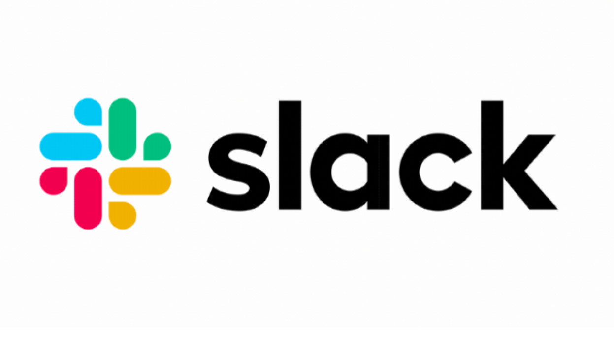
</div>

The biggest advantage of Slack is that it can be used on many different platforms such as computers, Android, and iOS, so all employees in the company can use and chat with each other no matter what device they use. Internet connection.

### Reality
That advantage has attracted many international companies to use Slack and led to a situation where it is difficult to communicate in many different languages.

Have you ever been invited to a chat channel where people speak different languages ​​and you have a hard time keeping up with the conversation?

<div align="center">
    
</div>

### Here's Why:
* For that reason, I have researched and developed a Slack bot application to help automatically translate channel messages into a language of choice.


This is a simple Slackbot that supports the following features:
* Invite bot to chat channel (public)
* Remove bot from chat channel (public)
* Add language to language list for translation
* Remove the language from the list of languages ​​to translate
* Show list of languages ​​to translate
* Find the code of languages ​​that support translation

Slackbot monitors messages sent to the channel and automatically translates into selected languages ​​(text messages only)

<p align="right">(<a href="#readme-top">back to top</a>)</p>


### Built With

This section should list any major frameworks/libraries used to bootstrap my project. Leave any add-ons/plugins for the acknowledgements section. Here are a few stacks.

<table>
  <tr>
    <td halign="center" valign="middle"></td>
    <td halign="center" valign="middle">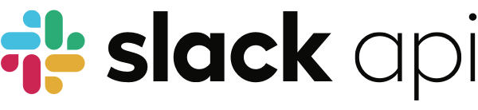</td>
  </tr>
  <tr>
    <td halign="center" valign="middle"></td>
    <td halign="center" valign="middle"></td>
  </tr>
  <tr>
    <td halign="center" valign="middle"></td>
    <td halign="center" valign="middle"></td>
  </tr>
</table>
<p align="right">(<a href="#readme-top">back to top</a>)</p>


<!-- GETTING STARTED -->
## Getting Started

This is an example of how you may give instructions on setting up your project locally.
To get a local copy up and running follow these simple steps.

### Prerequisites

This is an example of how to list things you need to use the software and how to install them.
* Docker
  ```sh
  sudo apt-get remove docker docker-engine docker.io containerd runc
  sudo apt-get update
  sudo apt-get install -y \
    ca-certificates \
    curl \
    gnupg \
    lsb-release
  sudo rm -rf /usr/share/keyrings/docker-archive-keyring.gpg
  curl -fsSL https://download.docker.com/linux/ubuntu/gpg | sudo gpg --dearmor -o /usr/share/keyrings/docker-archive-keyring.gpg
  echo \
  "deb [arch=$(dpkg --print-architecture) signed-by=/usr/share/keyrings/docker-archive-keyring.gpg] https://download.docker.com/linux/ubuntu \
  $(lsb_release -cs) stable" | sudo tee /etc/apt/sources.list.d/docker.list > /dev/null
  sudo apt-get update
  sudo apt-get install -y docker-ce docker-ce-cli containerd.io
  sudo usermod -a -G docker $USER
  sudo curl -L "https://github.com/docker/compose/releases/download/v2.2.2/docker-compose-linux-$(uname -m)" -o /usr/local/bin/docker-compose
  sudo chmod +x /usr/local/bin/docker-compose
  ```
#### Create `.env` File, With Keys For: 
- Slack tokens - sign up for Slack, "Add a Bot User" to create your bot, and go to the Basic Information panel to find:
  - `SLACK_BOT_TOKEN`
  - `SLACK_SIGNING_SECRET`
  - `SLACK_APP_TOKEN`
#### Add The Bot To The Slack Workspace:
- enable Slash Commands (see [minute 6 of this tutorial](https://medium.com/slack-developer-blog/build-a-serverless-slack-bot-in-9-minutes-with-node-js-and-stdlib-b993cfa15358))
- modify `SLACK_BOT_TOKEN` from Your Slack App Dashboard -> Install App -> Bot User OAuth Token

<br />
    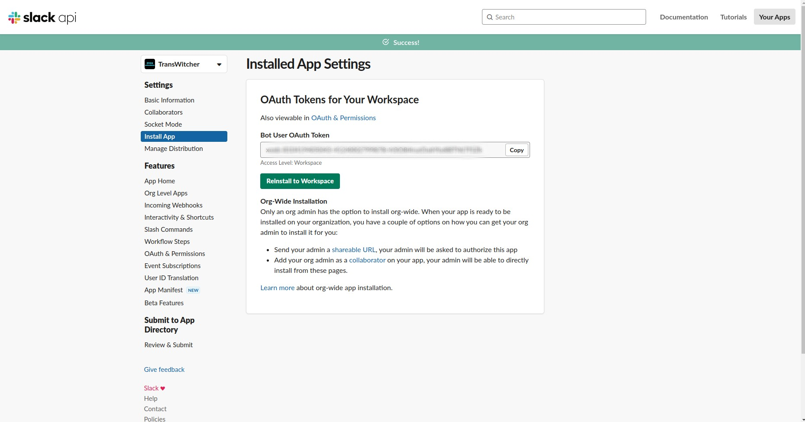
<br />

- modify `SLACK_SIGNING_SECRET` from Your Slack App Dashboard -> Basic information -> App Credentials -> Client Secret

<br />
    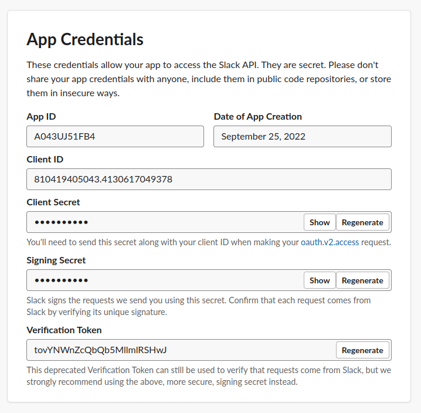
<br />

- modify `SLACK_APP_TOKEN` from Your Slack App Dashboard -> Basic information -> App-Level Tokens -> Tokens
<br />
    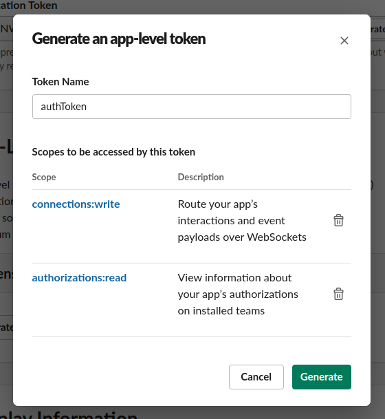
<br />
<br />
    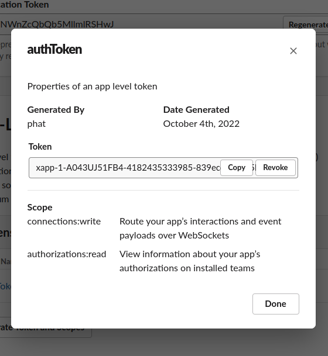
<br />

#### Add The Bot To The Slack Workspace:
- Go to your Dashboard -> OAuth & Permissions :
    - channels:history
    - channels:join
    - channels:manage
    - channels:read
    - chat:write
    - chat:write.customize
    - chat:write.public
    - commands
    - emoji:read
    - groups:history
    - groups:write
    - im:history
    - im:write
    - incoming-webhook
    - mpim:history
    - mpim:write
    - users.profile:read
    - users:read

<br />
    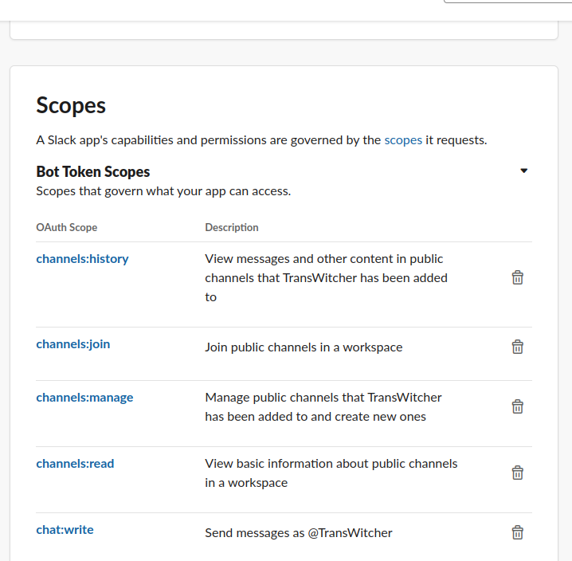
<br />

<br />
    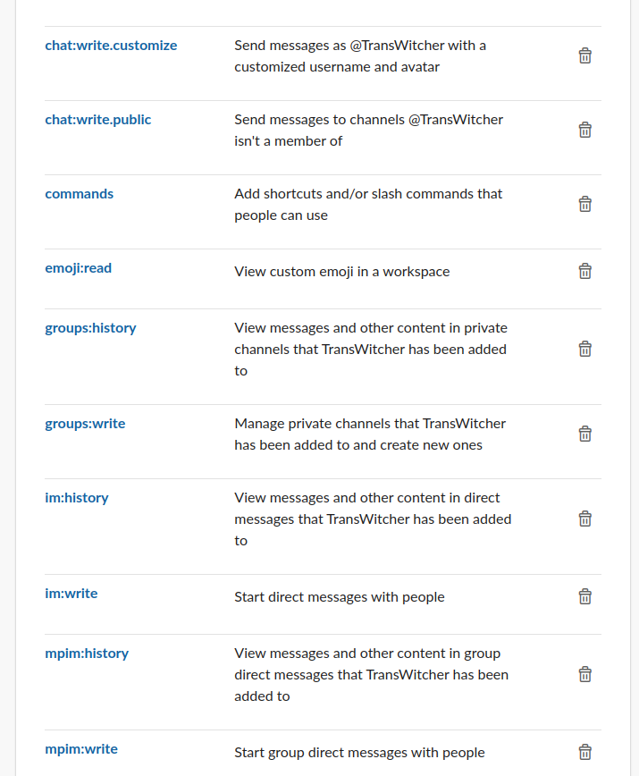
<br />

<br />
    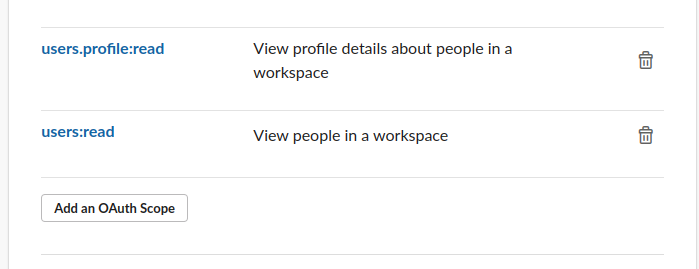
<br />

- Go to your Dashboard -> Event Subscriptions -> Subscribe to bot events:
    - message.channels
    - message.groups
    - message.im
    - message.mpim

<br />
    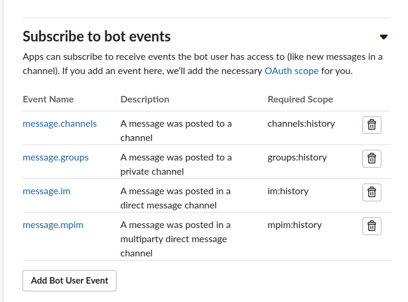
<br />


#### Enable Theses Slash Command
- type `/heybot [language]` in a slack public channel to invite bot to channel.
<br />
    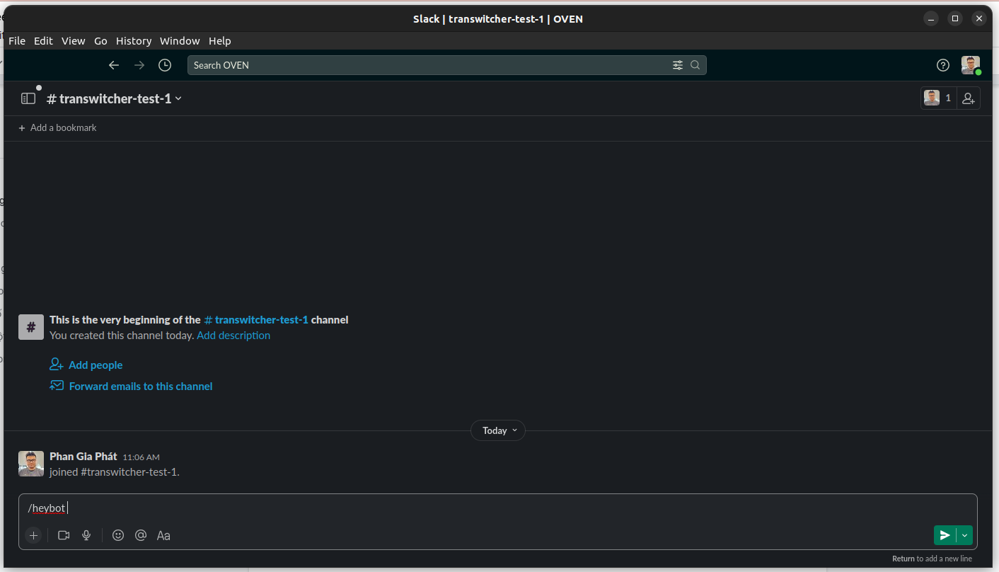
<br />
<br />
    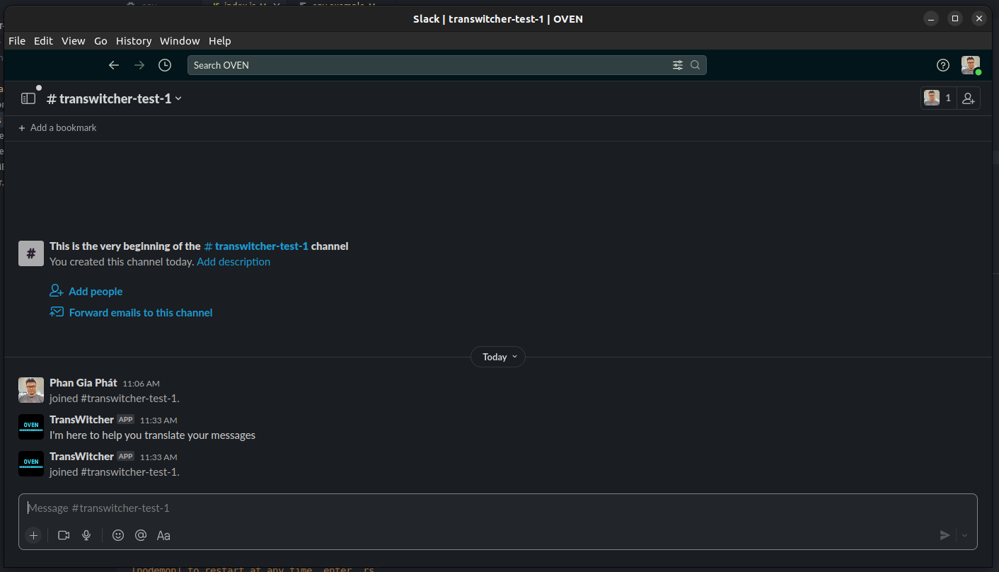
<br />
- type `/byebot [language]` in a public channel that Bot was invited to remove him.
<br />
    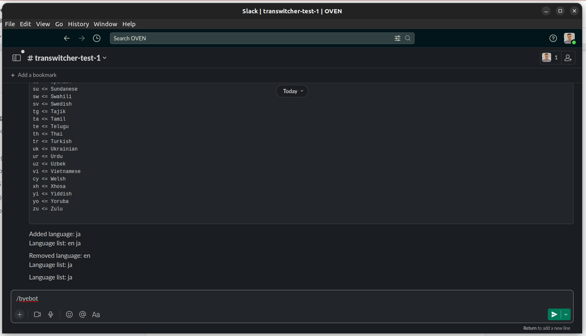
<br />
<br />
    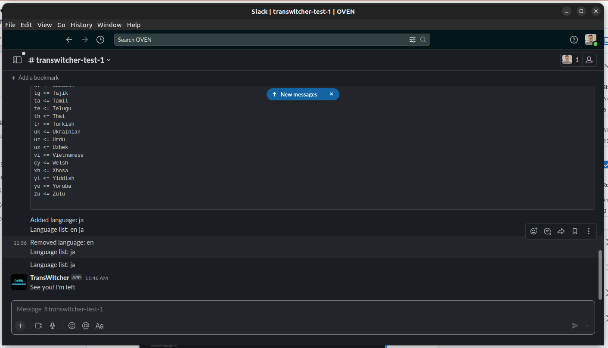
<br />
- type `/addlang [language]` in a public channel that Bot was invited with `2 digit ISO language code` to add language.
    - Example: `/addlang en` for add English to translate languages list.
    - Example: `/addlang ja` for add Japanese to translate languages list.
    - Example: `/addlang vi` for add Vietnamese to translate languages list.
<br />
    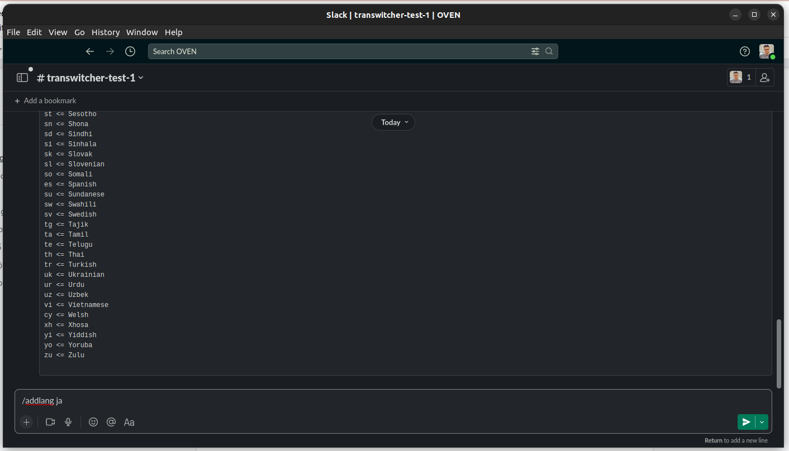
<br />
<br />
    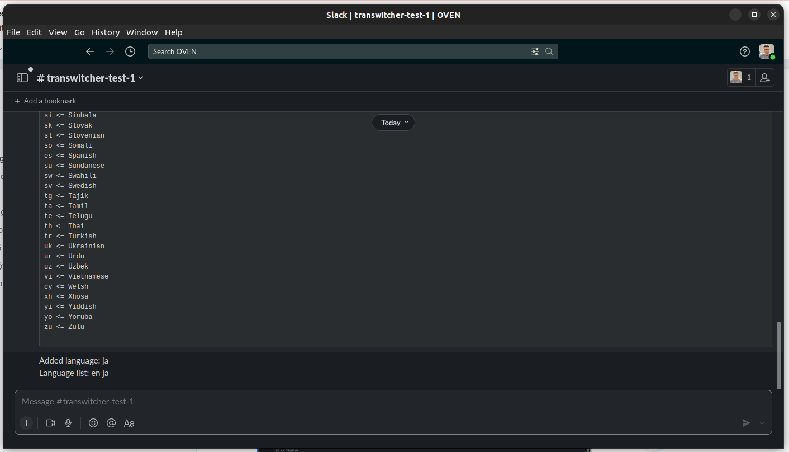
<br />
- type `/byelang [language]` in a public channel that Bot was invited with `2 digit ISO language code` to remove language.
    - Example: `/byelang en` for remove English to translate languages list.
    - Example: `/byelang ja` for remove Japanese to translate languages list.
    - Example: `/byelang vi` for remove Vietnamese to translate languages list.
<br />
    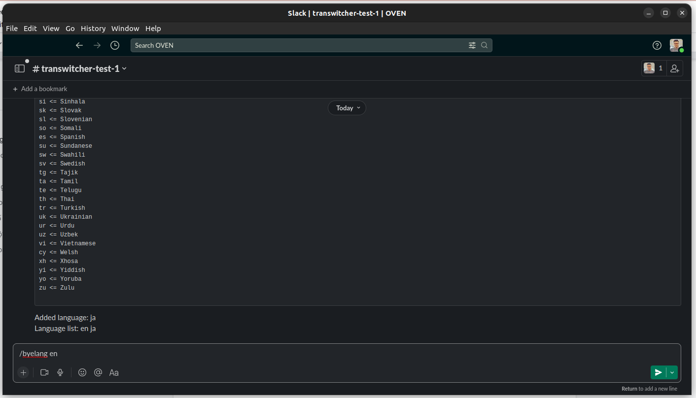
<br />
<br />
    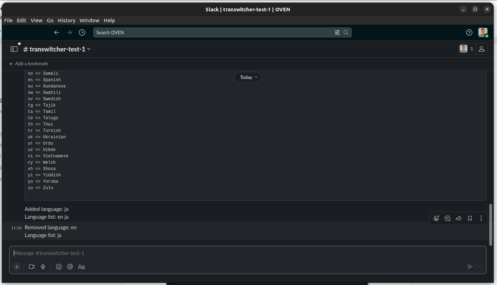
<br />
- type `/listlang` in a public channel that Bot was invited to show current languages list.
<br />
    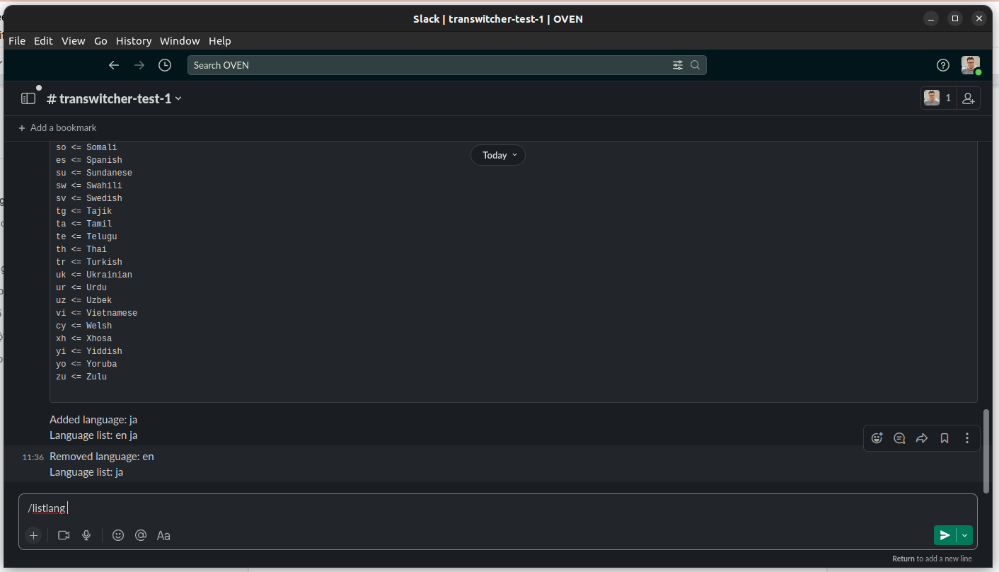
<br />
<br />
    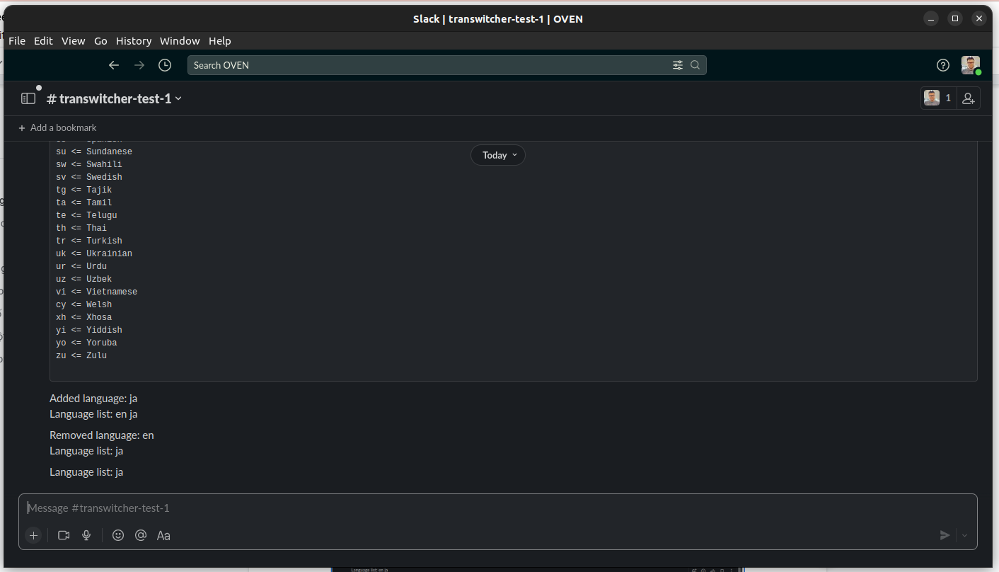
<br />
- type `/findlang` in a public channel that Bot was invited to show supported language list to translate.
<br />
    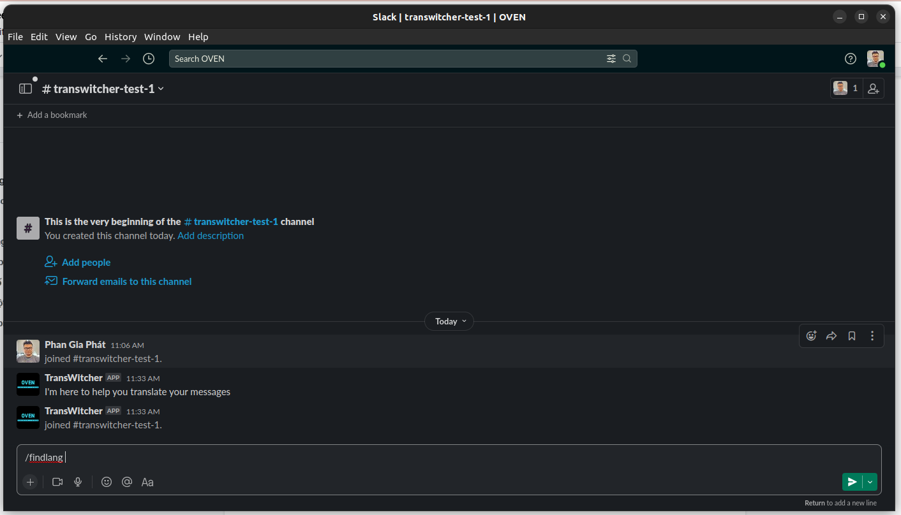
<br />
<br />
    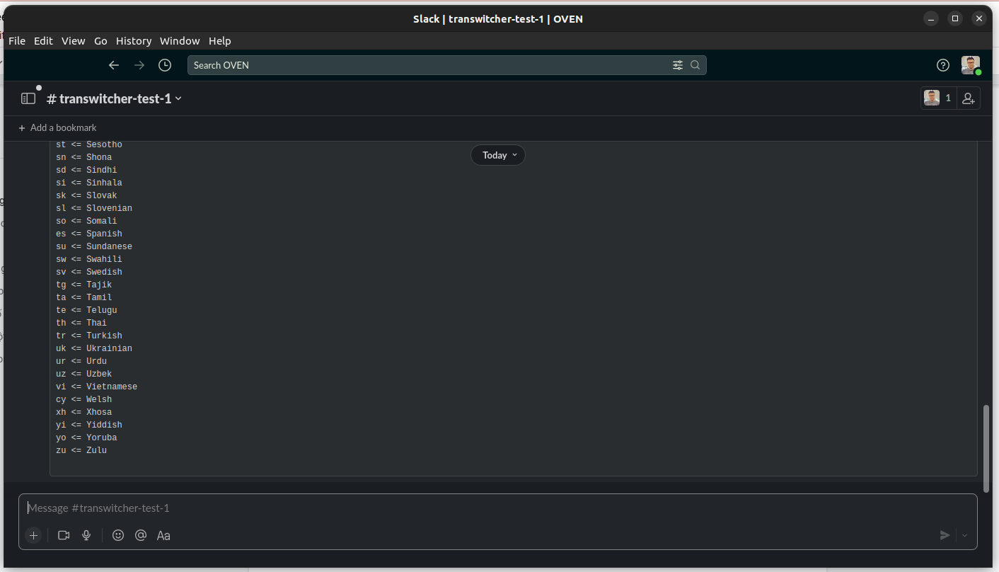
<br />

### Installation

_Below is an example of how you can instruct your audience on installing and setting up your app. This template doesn't rely on any external dependencies or services._

1. Clone the repo
   ```sh
   git clone https://github.com/PhanGiaPhat/slack-bot-translate.git
   ```
3. Install NPM packages
   ```sh
   npm install
   ```
4. Modify your TOKEN KEY in `.env`
   ```sh
   SLACK_BOT_TOKEN={SLACK_BOT_TOKEN}
   SLACK_APP_TOKEN={SLACK_APP_TOKEN}
   SLACK_SIGNING_SECRET={SLACK_SIGNING_SECRET}
   ```

- Run with Docker
  - Modify your TOKEN KEY at readonly variables in `start.sh`
   ```sh
   readonly SLACK_BOT_TOKEN={SLACK_BOT_TOKEN}
   readonly SLACK_APP_TOKEN={SLACK_APP_TOKEN}
   readonly SLACK_SIGNING_SECRET={SLACK_SIGNING_SECRET}
   ```
  - Run with `start.sh`
   ```sh
   bash start.sh
   ```

<p align="right">(<a href="#readme-top">back to top</a>)</p>

<!-- ROADMAP -->
## Roadmap

- [x] Add bot to public channel
- [x] Command to find languages to be supported
- [x] Command to show list of language that translated to
- [x] Command to add language to be translated
- [x] Command to remove language to be translated
- [x] Automatic translation
- [x] Remove bot from public channel
- [ ] Add bot to private channel & direct message
- [ ] Able to detect variety of messages
- [ ] Send direct message to bot
- [X] Multi-language Support


<p align="right">(<a href="#readme-top">back to top</a>)</p>


<!-- CONTRIBUTING -->
## Contributing

Contributions are what make the open source community such an amazing place to learn, inspire, and create. Any contributions you make are **greatly appreciated**.

If you have a suggestion that would make this better, please fork the repo and create a pull request. You can also simply open an issue with the tag "enhancement".
Don't forget to give the project a star! Thanks again!

1. Fork the Project
2. Create your Feature Branch (`git checkout -b feature/AmazingFeature`)
3. Commit your Changes (`git commit -m 'Add some AmazingFeature'`)
4. Push to the Branch (`git push origin feature/AmazingFeature`)
5. Open a Pull Request

<p align="right">(<a href="#readme-top">back to top</a>)</p>


<!-- LICENSE -->
## License

Distributed under the MIT License. See `LICENSE.txt` for more information.

<p align="right">(<a href="#readme-top">back to top</a>)</p>


<!-- CONTACT -->
## Contact

Phan Gia Phat  - phat@oven.bz

Project Link: [https://github.com/PhanGiaPhat/slack-bot-translate](https://github.com/PhanGiaPhat/slack-bot-translate)

<p align="right">(<a href="#readme-top">back to top</a>)</p>
